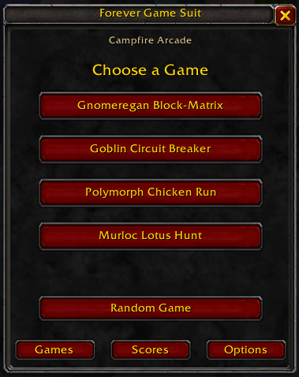
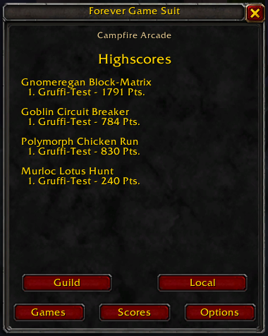
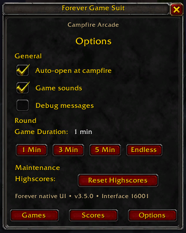
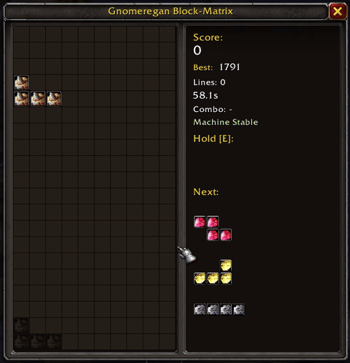
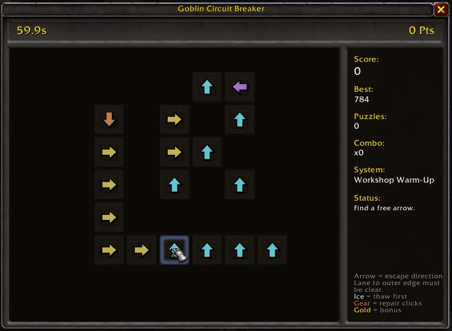
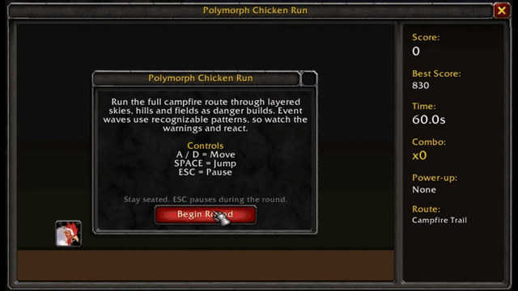

# Forever Game Suit

**Forever Game Suit** is a campfire arcade addon for **World of Warcraft: Forever** (Interface `16001`).

It adds four short minigames built around campfire downtime while keeping the presentation close to the native WoW Forever client. The addon deliberately prefers Blizzard/Forever frames, fonts, buttons, icons and UI textures instead of generic custom fantasy artwork.

> **Current version:** 3.5.0

## Interface preview

<p align="center">
  
  
  
</p>

The hub, highscores and options stay inside the same compact Blizzard-style window so the addon feels like one coherent part of the WoW Forever UI.

## Games

### Polymorph Chicken Run
Run, jump and survive the campfire timer while the route becomes increasingly chaotic.

- Bombs, rockets and meteors
- Event waves and recognizable hazard patterns
- Near-miss and combo bonuses
- Power-ups
- Layered scrolling scenery
- Final Meltdown phase

### Murloc Lotus Hunt
Guide a growing Murloc through the bog while collecting Lotus flowers and avoiding hazards.

- Lotus streak system
- Golden Lotus bonuses
- Connected growing Murloc body
- Bog hazards and warning phases
- Increasing speed and difficulty
- Final Hunt phase

### Gnomeregan Block-Matrix
A Gnomeregan-themed falling-block minigame with modern quality-of-life features.

- Ghost piece
- Hard Drop
- Hold piece
- Three-piece preview
- 7-bag generation
- Combos and Back-to-Back bonuses
- Lock delay and wall kicks
- Hold A / D for continuous movement
- Pressure, Overdrive and Meltdown phases

### Goblin Circuit Breaker
A Goblin-engineering **Arrow Jam** puzzle. Remove directional components only when their escape path is clear.

- Solvable randomized boards
- Frozen components
- Repair nodes
- Golden bonus arrows
- Combo scoring
- Increasing puzzle density and difficulty

## Campfire Arcade

The default round lasts **60 seconds** and can be changed from the built-in Options panel.

While a minigame is active, the addon captures the relevant movement keys so your character remains seated at the campfire. `ESC` pauses and resumes the current game.

## Highscores

Each game keeps its own highscore. Forever Game Suit also supports guild score sharing so guild members can compare results.

Your own highscores can be reset from **Options → Maintenance**. A confirmation dialog prevents accidental resets.

## Options

Options stay directly inside the Forever Game Suit hub and use native WoW-style controls.

Current settings include:

- Game sounds
- Round duration
- Highscore reset
- Addon version/status information

## Controls

Controls are shown on each game's start screen. Common controls include:

- `A / D` — movement
- `SPACE` — jump / hard drop depending on the game
- `E` — hold piece in Block-Matrix
- `ESC` — pause / resume

## Opening the addon

Use any of the following:

- `/fgs`
- Minimap button
- AddOn Compartment

Useful commands:

- `/fgs status` — show addon/campfire status
- `/fgs debug` — toggle debug messages

## Installation

1. Download the latest release.
2. Extract the `ForeverGameSuit` folder.
3. Copy it to your WoW Forever AddOns directory, for example:

   `World of Warcraft/_classic_beta_/Interface/AddOns/`

4. Restart the client or `/reload`.
5. Make sure **Forever Game Suit** is enabled in the AddOns list.

The folder layout should look like this:

```text
Interface/AddOns/ForeverGameSuit/
├── ForeverGameSuit.toc
├── ForeverGameSuit.lua
├── CampfireArrows.lua
├── CampfireJump.lua
├── CampfireSnake.lua
├── campfiretris.lua
└── media/
```

## Gameplay preview

### Gnomeregan Block-Matrix

<p align="center">
  
</p>

### Goblin Circuit Breaker

<p align="center">
  
</p>

### Polymorph Chicken Run

<p align="center">
  
</p>

## Project structure

- `ForeverGameSuit.lua` — hub, options, highscores, guild sync, input helpers, pause system and data migrations
- `campfiretris.lua` — Gnomeregan Block-Matrix
- `CampfireArrows.lua` — Goblin Circuit Breaker / Arrow Jam
- `CampfireJump.lua` — Polymorph Chicken Run
- `CampfireSnake.lua` — Murloc Lotus Hunt
- `media/` — addon-owned minimap and arrow textures

## UI direction

Native **WoW Forever** presentation is a project requirement.

New UI should prefer Blizzard templates and objects such as:

- `BasicFrameTemplateWithInset`
- `InsetFrameTemplate`
- `UIPanelButtonTemplate`
- `GameFont*`
- native Blizzard/Forever icons and textures

The project intentionally avoids generic AI-generated fantasy UI and artwork.

## Development

Forever Game Suit is actively developed and tested against the current WoW Forever beta client.

Bug reports and suggestions are welcome through GitHub Issues.

See [CHANGELOG.md](CHANGELOG.md) for version history.

## Disclaimer

Forever Game Suit is a fan-made addon.

World of Warcraft, Warcraft and related assets are trademarks and property of their respective owners. This project is not affiliated with or endorsed by Blizzard Entertainment or the WoW Forever team.
